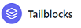

# Shopify.in Clone

⭕ **This Site is Fully Responsive**
 
 

## 📌 **Live Site URL:** <a href="https://630267cc37e9f833a16db1b6--shopifyclone-hitesh-pal.netlify.app/">**Visit Now** 🚀</a>

 

## 📌 Tech Stack

&nbsp;
&nbsp;
&nbsp;
&nbsp;

 
 

## 📌 Overview

 

## 📌 What I Learned

💡 Learn to use built in components from **Tailblock and Mamba UI**.

💡 learn to make Website Responsive in Tailwind CSS.

💡 Learn mobile-first design using Tailwind.

💡 How to develop full fledge landing page.

💡 Learn to plan such a huge project.

💡 Learn how to build fluid layouts using FlexBox and Grid.

## 📌 Connect With Me

- **LinkedIn** - [Hitesh Pal](https://www.linkedin.com/in/hitesh-pal-8379011ab/)
- **Twitter** - [@HiteshP25522550](https://twitter.com/HiteshP25522550)

## 📌 Acknowledgments

- Course Instructor - [Hitesh Choudhary](https://github.com/hiteshchoudhary)
- Icons Used For Tech Stack Section - [https://img.shields.io](https://img.shields.io)
- This ReadMe File Inspired From - [Jigar Sable](https://github.com/jigar-sable)
